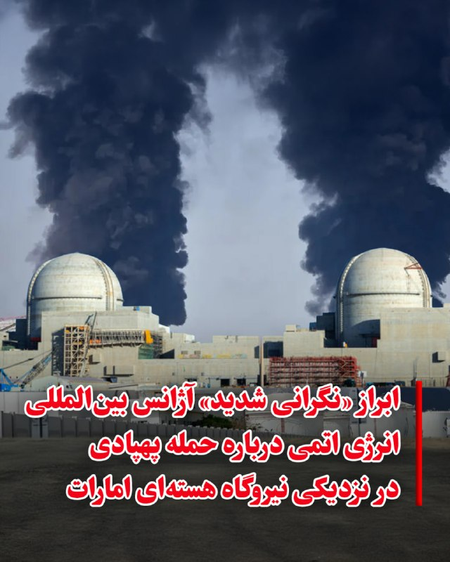
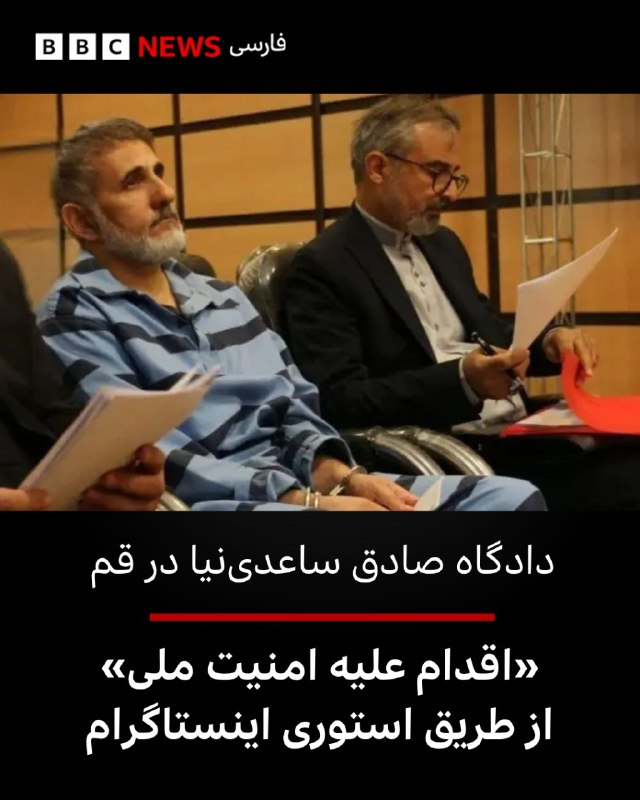
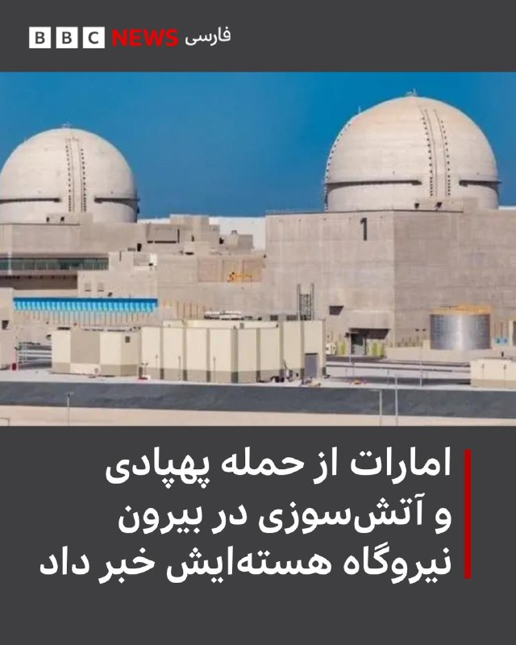
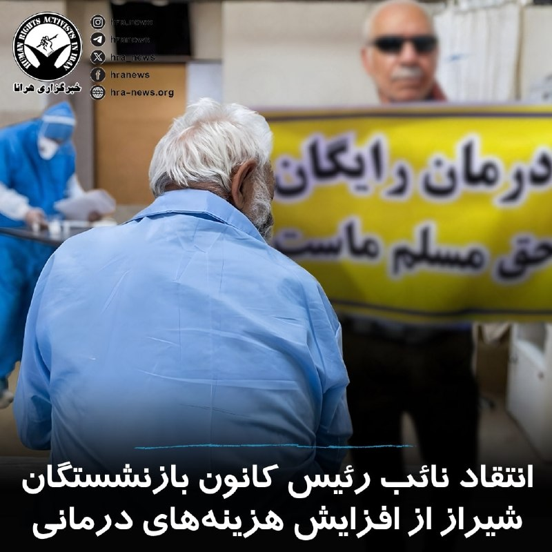

# خواننده تلگرام

<!-- TOP_NAV START -->

<!-- TOP_NAV END -->

<!-- MSG START -->

---
📅 بروزرسانی: 1405/02/27 17:36
---

## VahidOOnLine — post 240631

  

♦️شبکه خبری فاکس نیوز، روز یکشنبه ۲۷ اردیبهشت ماه در گزارشی اعلام کرد، دونالد ترامپ، رئیس جمهور آمریکا که به تازگی از سفر چین بازگشته است، در حال بررسی از سرگیری اقدام نظامی علیه ایران است و روز یکشنبه با بنیامین نتانیاهو، نخست وزیر اسرائیل گفتگو خواهد کرد.
نتانیاهو صبح یکشنبه با اعلام آنکه «مانند هر چند روز یکبار» با ترامپ تماس خواهد گرفت، گفت: «مطمئنا بخش‌هایی از سفر او به چین و شاید موارد دیگر را خواهم شنید. احتمالات زیادی وجود دارد و ما برای هر سناریویی آماده‌ایم.»
تماس تلفنی با نتانیاهو در حالی صورت می‌گیرد که فاکس نیوز با استناد به ارزیابی‌های اطلاعاتی منطقه‌ای درباره ایران گزارش داد که ممکن است به دلیل ناامیدی ترامپ از تهران و «رد درخواست او برای دست کشیدن از آرمان‌های تسلیحات هسته‌ای»، حملات نظامی از سر گرفته شود.
دو مقام اطلاعاتی منطقه‌ای به فاکس نیوز گفتند: «ارزیابی غالب در داخل ایران این است که رئیس جمهوری ترامپ ممکن است به شروع مجدد اقدام نظامی متوسل شود و تهران اکنون عمدا راهبرد «فریب و تأخیر» را دنبال می‌کند، با این امید که خرید زمان، هرگونه بازگشت احتمالی به جنگ را پیچیده کند.»
‌🇸🇦 Indypersian

🤖 @VahidOOnLine

## VahidOOnLine — post 240630

  

اردن حمله پهپادی به ابوظبی را که به وقوع آتش‌سوزی در خارج از محدوده داخلی نیروگاه هسته‌ای براکه منجر شد، به‌شدت محکوم کرد و آن را نقض آشکار حاکمیت امارات متحده عربی، تهدیدی علیه امنیت و ثبات این کشور و نیز نقض صریح قوانین بین‌المللی و منشور سازمان ملل متحد دانست.

وزارت خارجه اردن در بیانیه‌ای با اعلام همبستگی کامل با امارات متحده عربی تاکید کرد که اَمان در کنار ابوظبی و تمامی اقداماتی که برای حفظ امنیت، حاکمیت و سلامت شهروندان و ساکنان خود انجام دهد، خواهد ایستاد.
‌🏁 🇬🇧 IranintlTV

🤖 @VahidOOnLine

## VahidOOnLine — post 240629

  

♦️مسعود پزشکیان، رئیس‌جمهوری ایران، روز یکشنبه در دیدار با محسن نقوی، وزیر کشور پاکستان، از نقش اسلام‌آباد در تثبیت آتش‌بس قدردانی و ابراز امیدواری کرد تلاش‌های پاکستان به تقویت صلح و ثبات در منطقه کمک کند.
رئیس‌جمهوری ایران در این دیدار تاکید کرد «ایران خواهان روابطی صمیمانه و پایدار با کشورهای اسلامی منطقه است» و افزود اتحاد کشورهای اسلامی می‌تواند زمینه «مداخله قدرت‌های فرامنطقه‌ای» را کاهش دهد.
به گزارش خبرگزاری ایرنا، محسن نقوی، وزیر کشور پاکستان، نیز با اشاره به روابط تهران و اسلام‌آباد گفت ایران و پاکستان اکنون بیش از گذشته به یکدیگر نزدیک شده‌اند و روابط برادرانه دو کشور باید بیش از پیش گسترش یابد.
این دیدار در شرایطی انجام شده که پاکستان در هفته‌های اخیر در روند تلاش‌های دیپلماتیک و میانجی‌گری منطقه‌ای برای کاهش تنش‌ها و تثبیت آتش‌بس نقش فعالی ایفا کرده است.
‌🇸🇦 Indypersian

🤖 @VahidOOnLine

## VahidOOnLine — post 240628

  

اکسیوس گزارش داد که کوبا بیش از ۳۰۰ پهپاد نظامی خریداری کرده و اخیرا نیز گفت‌وگو درباره استفاده از آنها برای حمله به پایگاه آمریکا در خلیج گوانتانامو، شناورهای نظامی آمریکا و احتمالا شهر کی‌وست در ایالت فلوریدا، در حدود ۱۴۵ کیلومتری شمال هاوانا، را آغاز کرده است.

یک مقام ارشد آمریکایی به اکسیوس گفت این اطلاعات که می‌تواند دلیلی برای اقدام نظامی آمریکا شود، نشان می‌دهد دولت ترامپ تا چه اندازه کوبا را، به دلیل تحولات جنگ پهپادی و حضور مستشاران نظامی جمهوری اسلامی در هاوانا، تهدید تلقی می‌کند.

این مقام آمریکایی گفت: «وقتی به این نوع فناوری‌ها که تا این اندازه نزدیک هستند فکر می‌کنیم، و همچنین به طیفی از بازیگران خطرناک از گروه‌های تروریستی گرفته تا کارتل‌های مواد مخدر، مستشاران جمهوری اسلامی و روس‌ها، موضوع نگران‌کننده می‌شود.»
‌🏁 🇬🇧 IranintlTV

🤖 @VahidOOnLine

## VahidOOnLine — post 240627

روایت شما از بحران اقتصادی در آتش‌بس- یکشنبه ۲۷ اردیبهشت‌ماه🗣

🔹واقعا دیگه هیچ امیدی ندارم. سه ماهه به‌خاطر قطعی اینترنت بیکار موندیم. پهنای باند این‌قدر کمه که نه فیلترشکن جواب داده و نه اینترنت‌پرو.

🔹من مدرس آنلاین زبان بودم. الان دو ماه گذشته و حتی یک کلاس هم نتونستم برگزار کنم. از پس‌اندازم فقط دو میلیون تومان مونده و نمی‌تونم کار هم پیدا کنم.

🔹منم مثل خیلی از هم‌وطنان بیکار شدم و برای ادامه زندگی، با قسط و قرض یه کامیون خریدم. اما سوخت کامیون خیلی کمه و ناچارم یک لیتر گازوئیل رو ۵۰ تا ۷۵ هزار تومان بخرم که اصلاً مقرون‌به‌صرفه نیست. از یه طرف از بیکاری دارم دیوونه میشم و از طرف دیگه شرمنده زن و بچه شدم.

🔹اسنپ سوار شدم، کنارم روپوش پزشکی و چند تا کتاب دیدم. راننده جوان گفت که دانشجو هست و اوقات بین کلاس و بیمارستان اسنپ کار می‌کند.

🔹دلم می‌خواد خون گریه کنم. سه ماه هست که بیکارم. پانزده روز دیگه باید خونه ۵۰ متری استیجاری‌ رو تحویل بدم، در حالی که اجاره و ودیعه سر به فلک کشیده و من فقط صد میلیون تومان پول ودیعه بیشتر ندارم.

🔹من و همسرم تریدر هستیم و اول زندگی مشترکمونه. از جنگ ۱۲ روزه تا الان همش از جیب، اجاره و هزینه‌هامون رو دادیم. اما دیگه نمی‌دونیم باید چکار کنیم. امیدوارم این همه سختی و مشکلات نتیجه‌اش برگشت پهلوی باشه.

🔹۱۰ تیکه فیله‌مرغ، ۴ تیکه بوقلمون و یک شانه تخم‌مرغ شد شش میلیون و ۳۰۰ هزار تومان. واقعا باورنکردنیه.

🔹 دانشجو علوم پزشکی تهران هستم. متاسفانه هیچ دسترسی به اینترنت آزاد و بین‌الملل برای دانشجویان در نظر گرفته نشده. مقالات، پروژه‌ها و پایان‌نامه‌های ما به‌خاطر نداشتن دسترسی به چیزی که حق طبیعی هر انسانی است، ناتمام مونده.
‌🏁 🇬🇧 IranintlTV

🤖 @VahidOOnLine

## VahidOOnLine — post 240626

♦️حمیدرضا حاجی‌بابایی، نایب رئیس مجلس شورای اسلامی در برنامه‌ای تلویزیونی کشورهای منطقه را تهدید کرد در صورت وارد شدن آسیب به زیرساخت‌ها یا صادرات نفت ایران، تهران کاری می‌کند که مدت قابل توجهی هیچ کشور دنیا به نفت منطقه دسترسی نداشته باشد.

او گفت: «اگر قرار باشد به نفت ما آسیب برسد، ما کاری می‌کنیم که دیگر آمریکا حداقل تا یک مدت قابل‌توجهی از این منطقه نفتی گیرش نیاید، یعنی دنیا نفتی گیرش نیاید. من یک نکته می‌خواهم بگویم، آمریکا مخصوصا ترامپ، امکان ندارد کاری را که بتواند انجام دهد و به نفع‌شان باشد، انجام ندهد. اگر کسی غیر از این فکر کند، یا ساده‌لوح است یا ممکن است اشکال در نوع فکر کردنش باشد.»
این تهدیدها در حالی مطرح می‌شود که جمهوری اسلامی در ماه‌های اخیر بارها تاسیسات نفتی در کشورهای منطقه را هدف حملات موشکی و پهپادی قرار داده است.
‌🇸🇦 Indypersian

🤖 @VahidOOnLine

## VahidOOnLine — post 240625

  <a href="telegram/content/VahidOOnLine_240625_1779026795.mp4" target="_blank">🎬 Download video</a>

راهپیمایی ایرانیان ساکن گوتنبرگ سوئد، یکشنبه ۲۷ اردیبهشت
‌🏁 🇬🇧 ManotoTV

🤖 @VahidOOnLine

## VahidOOnLine — post 240624

♦️تیم فوتبال زنان نائگوهیانگ اف‌سی کره شمالی روز یکشنبه برای حضور در مرحله نیمه‌نهایی لیگ قهرمانان زنان آسیا وارد کره جنوبی شد، سفری که نخستین حضور ورزشکاران کره شمالی در کره جنوبی طی هشت سال گذشته محسوب می‌شود.
هیات اعزامی این تیم شامل ۲۷ بازیکن و ۱۲ عضو کادر فنی است و پیش از دیدار روز چهارشنبه برابر تیم زنان سوون اف‌سی وارد کره جنوبی شده است. وزارت اتحاد کره جنوبی اعلام کرد این سفر بر اساس قوانین تبادل میان دو کره مجوز گرفته است و در صورت حذف تیم کره شمالی اعضای آن در اولین فرصت به کشورشان بازخواهند گشت.
به گزارش خبرگزاری یونهاپ کره جنوبی، استقبال عمومی از این مسابقه چشمگیر بوده و تمامی ۷ هزار و ۸۷ بلیت عرضه‌شده برای عموم در کمتر از یک روز به فروش رسیده است.
این سفر در حالی انجام می‌شود که روابط دو کره طی سال‌های اخیر با تنش‌های فزاینده همراه بوده است. پیونگ‌یانگ اخیرا کره جنوبی را «خصمانه‌ترین کشور» توصیف کرده و ایده اتحاد دو کره را رد کرده است. در مقابل، لی جائه‌میونگ، رئیس‌جمهوری کره جنوبی، خواهان بهبود روابط شده است.
‌🇸🇦 Indypersian

🤖 @VahidOOnLine

## VahidOOnLine — post 240623

  

♦️بنیامین نتانیاهو، نخست‌وزیر اسرائیل، روز یکشنبه در نشست هفتگی کابینه این کشور گفت شش سال پیش درباره تهدید پهپادها هشدار داده بود، اما اکنون با پیشرفت این فناوری و افزایش تهدیدها، اسرائیل در حال اجرای اقدامات تازه‌ای برای مقابله با آن است.

نتانیاهو گفت: «شش سال پیش در جلسه کابینه درباره تهدید پهپادها هشدار دادم.» او افزود در آن زمان این تهدید را بیشتر ابزاری برای ترور افراد می‌دانست، اما به گفته او تحولات سال‌های اخیر، به‌ویژه جنگ اوکراین، نشان داد پهپادها می‌توانند به عاملی تعیین‌کننده در میدان‌های نبرد تبدیل شوند.
نخست‌وزیر اسرائیل همچنین با اشاره به عملکرد نهادهای امنیتی این کشور گفت ارتش و وزارت دفاع طی سال‌های گذشته «صدها و شاید هزاران» تلاش برای حمله به نیروهای اسرائیلی با پهپادها و هواپیماهای بدون سرنشین را خنثی کرده‌اند.

او تاکید کرد: «آنها موفق شده‌اند و هر بار که تهدید جدیدی ایجاد می‌شود، آن را خنثی می‌کنند.»

نتانیاهو در ادامه از تشکیل یک تیم ویژه برای مقابله با تهدید پهپادهای فیبر نوری حزب‌الله خبر داد و گفت این گروه طی دو هفته گذشته سه نشست برگزار کرده است.
‌🇸🇦 Indypersian

🤖 @VahidOOnLine

## VahidOOnLine — post 240622

ولی‌الله بیاتی، عضو کمیسیون امور داخلی مجلس، به ایسنا گفت: «مذاکرات باید ادامه پیدا کند، اما در عین حال دست ما روی ماشه است و آمادگی کامل برای ادامه نبرد وجود دارد.»
بیاتی گفت: «وضعیت «نه صلح نه جنگ» خیلی از کارها را در کشور معطل نگه می دارد. این وضعیت آسیب زیادی وارد می‌کند.»
‌🏁 🇬🇧 IranintlTV

🤖 @VahidOOnLine

## VahidOOnLine — post 240621

  

♦️سفارت پاکستان در تهران اعلام کرد محسن نقوی، وزیر کشور پاکستان که روز گذشته وارد تهران شده بود، نزدیک به سه ساعت در نهاد ریاست‌جمهوری حضور داشته و با مسعود پزشکیان دیداری خصوصی برگزار کرده است.
به گقته سفارت پاکستان، این دیدار حدود ۹۰ دقیقه طول کشیده و اسکندر مومنی، وزیر کشور جمهوری اسلامی ایران و عباس عراقچی، وزیر امور خارجه نیز در این جلسه حضور داشتند.
محسن نقوی روز شنبه در سفری اعلام‌نشده وارد تهران شده بود و منابع خبری از احتمال گفتگوهای او با مقام‌های ایرانی درباره تحولات منطقه و مسائل دوجانبه خبر داده بودند.
‌🇸🇦 Indypersian

🤖 @VahidOOnLine

## VahidOOnLine — post 240620

  

♦️آژانس بین‌المللی انرژی اتمی (IAEA) روز یکشنبه ۲۷ اردیبهشت ماه، نسبت به حمله پهپادی در نزدیکی نیروگاه هسته‌ای براکه امارات متحده عربی که به وقوع آتش‌سوزی منجر شد، «نگرانی شدید» خود را ابراز کرد، اما اعلام کرد سطح تشعشعات در این منطقه همچنان در وضعیت عادی قرار دارد.
آژانس در پیامی در شبکه اجتماعی اکس اعلام کرد رافائل گروسی، مدیرکل این نهاد، درباره این حادثه ابراز نگرانی کرده و گفته است: «فعالیت‌های نظامی که ایمنی هسته‌ای را تهدید می‌کند، غیرقابل قبول است.»
آژانس بین‌المللی انرژی اتمی همچنین اعلام کرد مقام‌های امارات این نهاد را در جریان گذاشته‌اند که سطح تشعشعات در نیروگاه هسته‌ای براکه طبیعی است و هیچ موردی از مصدومیت گزارش نشده است.
دفتر رسانه‌ای ابوظبی روز یکشنبه اعلام کرد از آتش‌سوزی ناشی از حمله پهپادی به یک ژنراتور برق در خارج از محیط داخلی نیروگاه هسته‌ای براکه در منطقه الظفره خبر داد.
‌🇸🇦 Indypersian

🤖 @VahidOOnLine

## VahidOOnLine — post 240619

  

♦️اسماعیل بقایی، سخنگوی وزارت امور خارجه جمهوری اسلامی ایران، روز یکشنبه در پیامی در شبکه اجتماعی اکس، آمریکا و اسرائیل را متهم کرد که برای توجیه «جنگ انتخابی» و غیرقانونی، روایت «حفظ صلح و ثبات در بازارهای جهانی انرژی» را مطرح می‌کنند.

بقایی نوشت «سیاست‌های جنگ‌طلبانه و بی‌ملاحظه آمریکا و اسرائیل» روندهای دیپلماتیک را از بین برده است. بقایی آمریکا و اسرائیل را به تحمیل ناامنی در به مسیرهای حیاتی انرژی متهم کرد و مدعی شد واشنگتن و تل‌آویو ایران را به بی‌ثبات‌سازی متهم می‌کنند.

سخنگوی وزارت امور خارجه جمهوری اسلامی ایران این رویکرد را «الگوی همیشگی» آمریکا و اسرائیل توصیف کرد و نوشت: «آن‌ها بحران و جنگ ایجاد می‌کنند و سپس با شعار بازگرداندن ثبات و دفاع از صلح، مسیر تشدید تنش را در پیش می‌گیرند.»

او در پایان با نقل‌قولی تاریخی از کتاب آگریکولا اثر تاسیتوس (مورخ مشهور رومی) نوشت: «آن‌ها ویرانی می‌آفرینند و نامش را صلح می‌گذارند.»
‌🇸🇦 Indypersian

🤖 @VahidOOnLine

## VahidOOnLine — post 240618

  

♦️علیرضا یوسفی، ملی‌پوش دسته ۱۱۰+ کیلوگرم وزنه‌برداری ایران، در مسابقات قهرمانی آسیا در هند با ثبت عملکردی درخشان موفق شد رکورد دوضرب جهان را بشکند و سه مدال ارزشمند برای ایران به دست آورد.
یوسفی روز یکشنبه در شهر گاندی‌نگر هند، در رقابت با وزنه‌برداران مطرحی از کره‌جنوبی، بحرین، چین‌تایپه، ازبکستان و امارات روی تخته رفت و در پایان با کسب مدال طلای دوضرب، نقره مجموع و برنز یک‌ضرب، یکی از بهترین نتایج کاروان ایران را ثبت کرد.
این وزنه‌بردار ایرانی در حرکت سوم دوضرب موفق شد وزنه ۲۶۱ کیلوگرمی را مهار کند و ضمن کسب مدال طلا، رکورد جدید جهان را در این حرکت به نام خود ثبت کند. او پیش‌تر در حرکت دوم برای مهار همین وزنه ناموفق بود اما در سومین تلاش خود توانست این رکورد تاریخی را به ثبت برساند.
یوسفی در بخش یک‌ضرب ابتدا وزنه ۱۷۷ کیلوگرمی و سپس ۱۸۴ کیلوگرمی را با موفقیت بالای سر برد، اما در مهار وزنه ۱۸۹ کیلوگرمی ناکام ماند و به مدال برنز رسید.
او در دوضرب نیز ابتدا وزنه ۲۴۸ کیلوگرمی را مهار کرد و سپس در سومین حرکت، وزنه ۲۶۱ کیلوگرمی را بالای سر برد تا رکورد جهان را جابه‌جا کند.
‌🇸🇦 Indypersian

🤖 @VahidOOnLine

## WithYashar — post 11478

شاهزاده رضا پهلوی : جمهوری اسلامی را نمی‌توان تغییر داد همانگونه که یک گرگ را نمیتوان تبدیل به میش کرد
@withyashar

## WithYashar — post 11477

  <a href="telegram/content/WithYashar_11477_1779026799.mp4" target="_blank">🎬 Download video</a>

صداوسیما: با اعلام مدیر کل آموزش و پرورش تهران؛ دانش آموزان پایه های هفتم تا دهم دیگه امتحان خرداد ندارن و با توجه به عملکرد علمی یکساله سنجیده میشن.
@withyashar

## mwarmonitor — post 9203

🇦🇪پدافند هوایی امارات متحده عربی با ۳ پهپاد برخورد کرده است.

🔴وزارت دفاع اعلام کرد که در تاریخ ۱۷ مه ۲۰۲۶، پدافند هوایی امارات با ۳ پهپاد که از سمت مرزهای غربی وارد کشور شده بودند مقابله کرده است. طبق این گزارش، دو فروند از آن‌ها با موفقیت رهگیری و منهدم شدند و سومی به یک مولد برق در خارج از محدوده داخلی نیروگاه هسته‌ای براکه در منطقه ظفره اصابت کرده است.

🔸این وزارتخانه افزود که تحقیقات برای شناسایی منبع این حملات ادامه دارد و پس از تکمیل بررسی‌ها، جزئیات بیشتری منتشر خواهد شد.

🔸همچنین تأکید شد که وزارت دفاع در بالاترین سطح آمادگی قرار دارد و با هرگونه تهدید با قاطعیت برخورد خواهد کرد تا امنیت، حاکمیت و ثبات کشور حفظ شود و از منافع و زیرساخت‌های ملی محافظت شود.

@mwarmonitor

## mwarmonitor — post 9202

  <a href="telegram/content/mwarmonitor_9202_1779026800.mp4" target="_blank">🎬 Download video</a>

✈️🚨پل هوایی عظیم نیروی هوایی آمریکا به خاورمیانه امروز هیچ نشانه‌ای از کاهش یا توقف ندارد.

@mwarmonitor

## mwarmonitor — post 9201

کوبا از نظر ایالات متحده به عنوان «دولت حامی تروریسم» طبقه‌بندی می‌شود و به عنوان «سر مار» برای صادرات مارکسیسم انقلابی در سراسر آمریکای لاتین در نظر گرفته می‌شود.
یکی از متحدان سابق کوبا، یعنی نیکلاس مادورو در ونزوئلا، در جریان حمله ۳ ژانویه توسط ایالات متحده از قدرت برکنار شد. از زمان برکناری مادورو، ایالات متحده روند عادی‌سازی روابط با ونزوئلا را آغاز کرده و اطلاعات بیشتری درباره برنامه پهپادی کوبا به دست آورده است.
واقعیت‌سنجی (ارزیابی واقعیت)
با این حال، مقامات آمریکایی بر این باور نیستند که کوبا یک تهدید قریب‌الوقوع است یا به طور فعال برای حمله به منافع آمریکا برنامه‌ریزی می‌کند. اما اطلاعات ایالات متحده نشان می‌دهد که مقامات نظامی این جزیره در حال بحث درباره برنامه‌های جنگ پهپادی بوده‌اند تا در صورت بروز درگیری هم‌زمان با وخیم‌تر شدن روابط با آمریکا، از آن‌ها استفاده کنند.
کوبا توانایی بستن تنگه فلوریدا را به همان شیوه‌ای که ایران کشتیرانی در تنگه هرمز را به بن‌بست کشانده است، ندارد. مقامات آمریکایی همچنین معتقدند کوبا به اندازه بحران موشکی کوبا در سال ۱۹۶۲ یک تهدید نظامی بزرگ به شمار نمی‌رود.
این مقام ارشد آمریکایی در پایان گفت:
«هیچ‌کس نگران جت‌های جنگنده کوبا نیست؛ حتی مشخص نیست که آن‌ها یک جنگنده آماده به پرواز داشته باشند. اما شایان ذکر است که آن‌ها چقدر نزدیک هستند — فقط ۹۰ مایل. این واقعیتی نیست که ما با آن راحت باشیم.»

🔸یادداشت سردبیر: این گزارش اصلاح شده است تا مشخص شود کوبا در سال ۱۹۹۶ دو هواپیما (و نه یک هواپیما) را سرنگون کرده است.

@mwarmonitor

## mwarmonitor — post 9200

🔴اختصاصی اکسیوس: آمریکا تهدید پهپادهای تهاجمی کوبا را زیر نظر دارد

📝نویسنده: مارک کاپوتو

🔰بر اساس اطلاعات طبقه‌بندی‌شده‌ای که با اکسیوس به اشتراک گذاشته شده است، کوبا بیش از ۳۰۰ پهپاد نظامی خریداری کرده و اخیراً گفتگوهایی را درباره برنامه‌ریزی برای استفاده از آن‌ها جهت حمله به پایگاه آمریکا در خلیج گوانتانامو، کشتی‌های نظامی ایالات متحده و احتمالاً «کی‌ وست» در ایالت فلوریدا (در فاصله ۹۰ مایلی شمال هاوانا) آغاز کرده است.

چرا این موضوع اهمیت دارد؟
یک مقام ارشد آمریکایی اعلام کرد این اطلاعات مأموریتی — که می‌تواند به بهانه‌ای برای اقدام نظامی ایالات متحده تبدیل شود — نشان می‌دهد که دولت ترامپ تا چه حد کوبا را به دلیل پیشرفت‌ها در جنگ پهپادی و حضور مستشاران نظامی ایران در هاوانا، یک تهدید تلقی می‌کند.
این مقام مسئول گفت:
«وقتی به وجود این نوع فناوری‌ها در چنین فاصله نزدیکی فکر می‌کنیم، و حضور طیفی از بازیگران بد از گروه‌های تروریستی گرفته تا کارتل‌های مواد مخدر، ایرانی‌ها و روس‌ها را در نظر می‌گیریم، نگران‌کننده است. این یک تهدید در حال رشد است.»
محور اخبار
به گفته یک مقام سیا به اکسیوس، جان راتکلیف، رئیس سازمان اطلاعات مرکزی آمریکا (CIA)، روز پنجشنبه به کوبا سفر کرد و به طور صریح به مقامات این کشور درباره هرگونه اقدام خصمانه هشدار داد. او همچنین از آن‌ها خواست تا به حکومت توتالیتر خود پایان دهند تا تحریم‌های فلج‌کننده آمریکا برچیده شود.
این مقام سیا گفت: «مدیر راتکلیف به وضوح روشن کرد که کوبا دیگر نمی‌تواند به عنوان سکویی برای دشمنان جهت پیشبرد برنامه‌های خصمانه در نیم‌کره ما عمل کند. نیم‌کره غربی نمی‌تواند حیاط خلوت و زمین بازی دشمنان ما باشد.»
علاوه بر این، وزارت دادگستری آمریکا قصد دارد روز چهارشنبه کیفرخواستی را علیه رهبر دوفاکتو (عملی) کوبا، رائول کاسترو، علنی کند. او متهم است که در سال ۱۹۹۶ دستور سرنگونی دو هواپیمای متعلق به یک گروه امدادی مستقر در میامی به نام «برادران برای نجات» (Brothers to the Rescue) را صادر کرده است.
انتظار می‌رود تحریم‌های بیشتری علیه این کشور جزیره‌ای در هفته جاری اعلام شود. سخنگوی کوبا روز شنبه برای اظهار نظر در این باره در دسترس نبود.
نگاه نزدیک‌تر (بررسی جزئیات)
به گفته مقامات آمریکایی، کوبا از سال ۲۰۲۳ در حال تهیه پهپادهای تهاجمی با «قابلیت‌های متنوع» از روسیه و ایران بوده و آن‌ها را در مکان‌های استراتژیک در سراسر این جزیره پنهان کرده است.
این مقام ارشد آمریکایی با استناد به شنودهای اطلاعاتی افزود که مقامات کوبا ظرف یک ماه گذشته به دنبال دریافت پهپادها و تجهیزات نظامی بیشتری از روسیه بوده‌اند. این اطلاعات همچنین نشان می‌دهد که مقامات اطلاعاتی کوبا در تلاش هستند تا یاد بگیرند «ایران چگونه در برابر ما مقاومت کرده است.»
روسیه و چین دارای تأسیسات جاسوسی پیشرفته برای جمع‌آوری «اطلاعات سیگنالی» (شنود الکترونیک یا SIGINT) در کوبا هستند.
پیت هگست، وزیر دفاع آمریکا، روز سه‌شنبه در جریان یک جلسه استماع در کنگره به ماریو دیاز-بالارت، نماینده جمهوری‌خواه میامی گفت: «ما مدت‌هاست نگران این بوده‌ایم که استفاده یک دشمن خارجی از موقعیتی در این فاصله نزدیک به سواحل ما، بسیار چالش‌برانگیز و مشکل‌ساز است.»
هگست در پاسخ به دیاز-بالارت، نقش و همدستی کاسترو در صدور دستور سرنگونی هواپیماهای گروه «برادران برای نجات» را تأیید کرد.
تصویر کلی
نگرانی‌ها درباره حملات پهپادی به نیروهای آمریکایی به دلیل استفاده ایران از هواپیماهای بدون سرنشین در پاسخ به حملات آمریکا (که از ۲۸ فوریه آغاز شد) شدت یافته است.
پهپادهای ایران به پایگاه‌های آمریکایی در خاورمیانه آسیب رسانده، به بستن تنگه هرمز کمک کرده و در کنار حملات موشکی، کشورهای همسایه در خلیج فارس را تهدید کرده‌اند.
مقامات آمریکایی تخمین می‌زنند که تا ۵,۰۰۰ سرباز کوبایی برای روسیه در تهاجم به اوکراین جنگیده‌اند و برخی از آن‌ها رهبران نظامی این جزیره را از میزان اثربخشی جنگ پهپادی مطلع کرده‌اند. به برآورد مقامات آمریکایی، روسیه به ازای هر سرباز اعزام‌شده به اوکراین، حدود ۲۵,۰۰۰ دلار به دولت کوبا پرداخت کرده است.
این مقام ارشد گفت: «آن‌ها بخشی از چرخ‌گوشت پوتین هستند. آن‌ها در حال یادگیری تاکتیک‌های ایرانی هستند. این چیزی است که ما باید برای آن برنامه‌ریزی کنیم.»
نگاه کلان
رژیم کاسترو به دلیل تحریم‌های ایالات متحده و سوءمدیریت مالی رژیم مارکسیستی، اکنون بیش از هر زمان دیگری پس از به قدرت رسیدن در انقلاب ۱۹۵۹ (که آن را وارد درگیری با آمریکا کرد)، به سقوط نزدیک شده است.

## FoxNewsTwitter — post 341833

Fox News (Twitter/X)

END OF AN ERA: Ronda Rousey's rousing return to UFC ended quickly, after the legendary fighter took down opponent Gina Carano in just 17 seconds in front of a packed, stunned crowd — wrapping up her historic MMA career.

Rousey claims she's done fighting for good and is embracing being a mom to her two kids, and that she's ready to expand her family again.

## FoxNewsTwitter — post 341832

  <a href="telegram/content/FoxNewsTwitter_341832_1779026802.mp4" target="_blank">🎬 Download video</a>

Fox News (Twitter/X)

Democrats vow to fight back over the Supreme Court's rulings on redistricting, as thousands took to the streets to march in Alabama.

"We have seen this before, where some people in black robes try to deny or take away our rights," Sen. Cory Booker said.

## pm_afshaa — post 90902

  <a href="telegram/content/pm_afshaa_90902_1779026803.webm" target="_blank">🎬 Download video</a>

🗣تجربه‌ای متفاوت از اینترنت پرسرعت 
🔺 سرعت بالا و پایدار 
🔺 مناسب برای استفاده روزمره و حرفه‌ای 
🔺 پشتیبانی سریع و همیشگی 
🔺 ساب‌لینک برای مدیریت مصرف 
⏱ اعتبار یک‌ماهه 
🧑‍💻 کاربر نامحدود 
🚀 با زرین بدون محدودیت وصل باش 
🤖 بات هوشمند 
💎 رضایت مشتری 
👤 پشتیبانی 
📣…

## pm_afshaa — post 90901

  <a href="telegram/content/pm_afshaa_90901_1779026804.webm" target="_blank">🎬 Download video</a>

🗣تجربه‌ای متفاوت از اینترنت پرسرعت

🔺 سرعت بالا و پایدار

🔺 مناسب برای استفاده روزمره و حرفه‌ای

🔺 پشتیبانی سریع و همیشگی

🔺 ساب‌لینک برای مدیریت مصرف

⏱ اعتبار یک‌ماهه 
🧑‍💻 کاربر نامحدود

🚀 با زرین بدون محدودیت وصل باش

🤖 بات هوشمند

💎 رضایت مشتری

👤 پشتیبانی

📣 کانال

🫥 زرین وی پی ان
🎤Zarin VPN

## pm_afshaa — post 90900

  <a href="telegram/content/pm_afshaa_90900_1779026804.webm" target="_blank">🎬 Download video</a>

🔴اکسیوس: کوبا از سال 2023 پیش از 300 پهپاد نظامی به دست آورده که خیلیشون از روسیه و ایران هستن. الانم دارن بحث میکنن که شاید بخوان از اینا علیه پایگاه دریایی آمریکا در خلیج گوانتانامو و کشتی‌های نظامی آمریکا استفاده کنن.

💧 Rainbet.com the #1 Non-KYC Crypto Casino & Sportsbook @rainbetcom

😁 @Pm_Afshaa

## pm_afshaa — post 90899

  <a href="telegram/content/pm_afshaa_90899_1779026805.webm" target="_blank">🎬 Download video</a>

🔴حاجی‌بابایی، نایب‌رییس مجلس:
اگه تاسیسات نفت ما رو بزنن، نفت دوست و دشمن در منطقه رو میزنیم.

💧 Rainbet.com the #1 Non-KYC Crypto Casino & Sportsbook @rainbetcom

😁 @Pm_Afshaa

## iaghapour — post 2617

از هر 10 نفری که که تو اینستاگرام وصل هستن 8 تاش دختره, 2 تاش هم پسر کانفیگ فروش 🥸

## DEJradio — post 4680

  <a href="telegram/content/DEJradio_4680_1779026805.webm" target="_blank">🎬 Download video</a>

🔸
🔺 ناو هواپیمابر یواس‌اس جرالد فورد که پیش از آغاز جنگ با ایران به خاورمیانه اعزام شده بود، پس از ۳۲۶ روز ماموریت، روز شنبه به ایالات متحده بازگشته است. این طولانی‌ترین ماموریت یک گروه رزمی ناو هواپیمابر آمریکا از زمان جنگ ویتنام تاکنون بوده است.
پیت هگست، وزیر دفاع آمریکا در نورفک در ایالت ویرجینیا برای استقبال از بزرگ‌ترین ناو هواپیمابر جهان حضور داشت.
به گفته ارتش آمریکا، این ناو در جریان ماموریت خود در عملیات‌های آمریکا در منطقه کارائیب مشارکت داشت؛ جایی که نیروهای آمریکایی به قایق‌های مظنون به قاچاق مواد مخدر حمله و نفتکش‌های تحریم‌شده را توقیف کردند، همچنین نیکلاس مادورو، رهبر ونزوئلا، را بازداشت کردند.

#آمریکا
@DEJradio

## DEJradio — post 4679

  

🧨
🔥 مقام‌های ابوظبی می‌گویند آتش‌سوزی ناشی از حمله یک پهپاد به یک ژنراتور برق در بیرون محدوده نیروگاه هسته‌ای براکه کنترل شده و به این نیروگاه آسیبی وارد نشده است.
یروگاه هسته‌ای براکه در منطقه ظفره امارات اولین نیروگاه هسته‌ای در جهان عرب است و از چهار رآکتور تشکیل شده است.
سازمان فدرال مقررات هسته‌ای امارات نیز اعلام کرد این آتش‌سوزی تأثیری بر ایمنی نیروگاه، سطح ایمنی پرتویی یا آمادگی سامانه‌های اصلی نیروگاه نداشته و همه واحدها به‌طور عادی به فعالیت خود ادامه می‌دهند.

این حادثه در حالی گزارش می‌شود که تنش‌های منطقه‌ای و حملات پهپادی در خلیج فارس نگرانی‌ها درباره امنیت زیرساخت‌های انرژی و تأسیسات حساس را افزایش داده است.

#انفجار #ابوظبی
@DEJradio

## VahidOnline — post 75514

محسن نقوی، وزیر کشور پاکستان، عصر امروز با محمدباقر قالیباف، رئیس مجلس ایران در تهران دیدار و گفت‌وگو کرد.

رسانه‌های ایرانی و پاکستانی گزارش داده‌‌اند که آقای نقوی برای از سرگیری مذاکرات به ایران سفر کرده است.

گفته شده او حامل پیام‌ آمریکاست و پاسخ ایران را هم دریافت خواهد کرد.

به گفته سفارت پاکستان در تهران، آقای نقوی دیروز پس از ورود به تهران «نزدیک به سه ساعت در نهاد ریاست جمهوری حضور داشت» و اسکندر مومنی، وزیر کشور، و عباس عراقچی، وزیر امور خارجه نیز «در جریان این دیدار در نهاد ریاست جمهوری حضور داشتند.»
علاوه بر این، محسن نقوی «دیداری خصوصی» با مسعود پزشکیان داشت که «حدود ۹۰ دقیقه به طول انجامید و با حضور وزیر کشور ایران همراه بود.»
@VahidHeadline

📡 @VahidOnline

## VahidOnline — post 75513

  

خبرگزاری فارس با انتشار متنی مدعی شد جزئیاتی از پاسخ آمریکا به پیشنهادهای ایران در جریان مذاکرات به دست آورده است؛ گزارشی که در آن از پنج شرط اصلی واشنگتن برای توافق با تهران سخن گفته شده است.

براساس شنیده‌های فارس، شروط اعلام‌شده از سوی آمریکا شامل موارد زیر است:

۱- عدم پرداخت هرگونه غرامت و خسارت از سوی آمریکا
۲- خروج و تحویل ۴۰۰ کیلوگرم اورانیوم از ایران به آمریکا
۳- فعال ماندن تنها یک مجموعه از تاسیسات هسته‌ای ایران
۴- عدم پرداخت حتی ۲۵ درصد از دارایی‌های بلوکه‌شده ایران
۵- منوط‌شدن توقف جنگ در همه ساحتها به انجام مذاکره

به گفته فارس، در مقابل، ایران انجام هرگونه مذاکره را منوط به تحقق پنج پیش‌شرط اعتمادساز دانسته است: «پایان جنگ در همه جبهه‌ها به‌ویژه لبنان»، «رفع تحریم‌های ضدایرانی»، «آزادسازی پول‌های بلوکه‌شده ایران»، «جبران خسارات ناشی از جنگ» و «پذیرش حق حاکمیت ایران بر تنگه هرمز».
@VahidOOnLine

📡 @VahidOnline

## VahidOnline — post 75512

  

عباس عراقچی، وزیر امور خارجه جمهوری اسلامی، در کانال تلگرامی خود اعلام کرد که کتاب «قدرت مذاکره» او به چاپ پنجم رسیده و در چاپ جدید این کتاب، بخش جدیدی با عنوان «دیپلماسی زیر آتش» درباره روند «مذاکرات غیرمستقیم با آمریکا در جنگ ۱۲ روزه» به آن افزوده شده است.
@VahidOOnLine

📡 @VahidOnline

## VahidOnline — post 75511

  

اداره رسانه‌ای ابوظبی روز یک‌شنبه ۲۷ اردیبهشت در شبکه‌های اجتماعی از وقوع آتش‌سوزی در نیروگاه اتمی براکه در امارات متحده عربی خبر داد.

این آتش‌سوزی پس از حمله پهپادی به نیروگاه اتمی برکه در منطقه الظَفرَه آغاز شده، اما کشته و مجروح بر جا نگذاشته است.

بر اساس توضیح اداره رسانه‌ای ابوظبی، این حریق در ژنراتور برق خارج از محدوده پیرامون نیروگاه به راه افتاده و بر ایمنی سایت اثر منفی نداشته است.

در پی آغاز حمله مشترک آمریکا و اسرائیل به خاک ایران، امارات متحده عربی به بزرگ‌ترین هدف حملات تلافی‌جویانه سپاه پاسداران تبدیل شد.
@VahidHeadline

📡 @VahidOnline

## VahidOnline — post 75510

  

خبرگزاری فارس، نزدیک به سپاه پاسداران، روز یک‌شنبه ۲۷ اردیبهشت نوشت که محمدباقر قالیباف، رئیس مجلس شورای اسلامی و عضو سابق سپاه، به عنوان نماینده ویژه ایران در امور چین تعیین شده است.

این خبرگزاری امنیتی بدون هیچ توضیح دیگری تنها نوشته است:‌ «پیشتر علی لاریجانی و عبدالرضا رحمانی‌ فضلی چنین مسئولیتی را برعهده داشتند.»

🔸در این خبر نه توضیح داده شده که چه کسی یا چه نهادی قالیباف را به این سمت منصوب کرده است و نه برهه کنونی چه اهمیتی دارد که حکومت تصور کرده است به این نماینده ویژه نیاز دارد.

اعلام تعیین قالیباف به عنوان نماینده ویژه در امور چین دو روز پس از دیدار رسمی رئیس جمهور آمریکا از کشور چین رخ می‌دهد که در آن یکی از موضوعات گفت‌وگو ایران و تنگه هرمز بود.
کاخ سفید روز پنجشنبه ۲۴ اردیبهشت اعلام کرد دونالد ترامپ، رئیس‌جمهور آمریکا، و شی جین‌پینگ، رئیس‌جمهور چین، در دیدار خود درباره گسترش همکاری‌های اقتصادی، باز ماندن تنگه هرمز و جلوگیری از دستیابی ایران به سلاح هسته‌ای گفت‌وگو و توافق کردند.
@VahidHeadline

📡 @VahidOnline

## VahidOnline — post 75509

  

جلسه دادگاه صادق ساعدی‌نیا، مدیر کافه‌های زنجیره‌ای ساعدی‌نیا که در اعتراضات سراسری دی ماه گذشته به همراه پدرش، محمدعلی ساعدی‌نیا، بازداشت شده بود در دادگاه انقلاب قم برگزار شد.

کافه‌های ساعدی‌نیا از جمله کسب‌وکارهایی بود که در اعتراضات دی ماه پارسال که با اعتراض بازار به نابسامانی اقتصادی آغاز شد، مغازه‌هایشان را تعطیل کردند.

نماینده دادستان قم در این جلسه آقای ساعدی‌نیا را به «فعالیت تبلیغی یا رسانه‌ای برخلاف امنیت کشور»، «اقدام عملیاتی برای گروه‌های معاند نظام از طریق انتشار استوری و فعالیت مجازی و حضور در تجمعات غیرقانونی و تعطیل کردن کافه‌ها و مغازه‌های خود در کل کشور و تشویق تعدادی از کارکنانش در ارتکاب جرایم علیه امنیت کشور» متهم کرد.

به گفته نماینده دادستان و قاضی، موارد اتهامی بر مبنای اطلاعاتی است که از محتوای لوازم الکترونیکی ضبط شده از آقای ساعدی‌نیا و از جمله تصاویر و چت‌های او در واتساپ استخراج شده است.
نماینده دادستان گفت که آقای ساعدی‌نیا در واتساپ خود «برنامه‌ریزی برای تعطیلی کافه‌ها را همزمان با صدور فراخوان دشمن به مشورت گذاشته بود.»
قاضی به او گفت: «شما با فراخوانی که داده‌اید با اقداماتی که انجام داده‌اید، این تعداد جوان را به این مهلکه وارد کرده‌اید و نظام متحمل صدمات زیادی شده است. چطور می‌توانید جبران کنید؟»
@VahidHeadline
نماینده دادستان، مواردی از جمله فعالیت‌های ساعدی‌نیا در فضای مجازی، تهیه کلیپی از یکی از کارکنانش با نوشته «جاوید شاه» روی دست، ایجاد و مدیریت گروه واتساپی کارکنان کافه‌ها، انتشار پیام صوتی درباره خاموش کردن گوشی برای جلوگیری از ردیابی، حضور برخی کارکنان در اعتراضات و برنامه‌ریزی برای تعطیلی کافه‌ها و کارخانه‌ها همزمان با فراخوان‌های اعتراضی را از مصادیق اتهامات مطرح‌شده علیه او عنوان کرد.
@VahidOOnLine

📡 @VahidOnline

## IranIntlTV — post 337630

  <a href="telegram/content/IranIntlTV_337630_1779026808.mp4" target="_blank">🎬 Download video</a>

یک شهروند با ارسال پیامی به ایران‌اینترنشنال می‌گوید: «در بلوچستان هر ۲۰ لیتر بنزینِ آزاد، بین یک میلیون و ۳۰۰ هزار تومان تا یک میلیون و ۵۰۰ هزار تومان شده؛ یعنی حدودا لیتری ۶۰ تا ۷۰ هزار تومان.»

## IranIntlTV — post 337629

  

🔻در حالی که تیم فوتبال ایران در اردوهای پیشین مشغول بازی با خودش بود و قرار است در اردوی ترکیه به مصاف گامبیا برود، تیم ملی عراق، دیگر نماینده آسیا در جام جهانی، در آخرین اردوی آماده‌سازی خود مقابل تیم‌های ملی آندورا و اسپانیا بازی دوستانه برگزار خواهد کرد.

🔹نکته قابل توجه این است که فدراسیون فوتبال ایران پس از قرعه‌کشی جام جهانی مدعی شده بود برای برگزاری دیدارهای تدارکاتی با اسپانیا و پرتغال به توافق رسیده است، اما این بازی‌ها نهایی نشد و اکنون عراق به‌جای ایران با تیم ملی اسپانیا بازی خواهد کرد.

🔹تیم ملی ایران علاوه بر این‌که هیچ حریف درجه یک یا درجه دویی برای بازی تدارکاتی ندارد، هنوز برای هیچ‌یک از بازیکنان و اعضای تیم نیز ویزای آمریکا صادر نشده است.

🔹مهدی تاج، رئیس فدراسیون فوتبال ایران، روز گذشته پس از دیدار با رئیس فدراسیون فوتبال ترکیه، از برگزاری بازی تدارکاتی با تیم ملی ترکیه پس از جام جهانی خبر داد.

🔹جزییات بیشتر را در سایت بخوانید.

@iranintltvsport

## IranIntlTV — post 337626

  

اردن حمله پهپادی به ابوظبی را که به وقوع آتش‌سوزی در خارج از محدوده داخلی نیروگاه هسته‌ای براکه منجر شد، به‌شدت محکوم کرد و آن را نقض آشکار حاکمیت امارات متحده عربی، تهدیدی علیه امنیت و ثبات این کشور و نیز نقض صریح قوانین بین‌المللی و منشور سازمان ملل متحد دانست.

وزارت خارجه اردن در بیانیه‌ای با اعلام همبستگی کامل با امارات متحده عربی تاکید کرد که اَمان در کنار ابوظبی و تمامی اقداماتی که برای حفظ امنیت، حاکمیت و سلامت شهروندان و ساکنان خود انجام دهد، خواهد ایستاد.
https://iranintl.com/202605171312

## IranIntlTV — post 337625

  

اکسیوس گزارش داد که کوبا بیش از ۳۰۰ پهپاد نظامی خریداری کرده و اخیرا نیز گفت‌وگو درباره استفاده از آنها برای حمله به پایگاه آمریکا در خلیج گوانتانامو، شناورهای نظامی آمریکا و احتمالا شهر کی‌وست در ایالت فلوریدا، در حدود ۱۴۵ کیلومتری شمال هاوانا، را آغاز کرده است.

یک مقام ارشد آمریکایی به اکسیوس گفت این اطلاعات که می‌تواند دلیلی برای اقدام نظامی آمریکا شود، نشان می‌دهد دولت ترامپ تا چه اندازه کوبا را، به دلیل تحولات جنگ پهپادی و حضور مستشاران نظامی جمهوری اسلامی در هاوانا، تهدید تلقی می‌کند.

این مقام آمریکایی گفت: «وقتی به این نوع فناوری‌ها که تا این اندازه نزدیک هستند فکر می‌کنیم، و همچنین به طیفی از بازیگران خطرناک از گروه‌های تروریستی گرفته تا کارتل‌های مواد مخدر، مستشاران جمهوری اسلامی و روس‌ها، موضوع نگران‌کننده می‌شود.»
https://iranintl.com/202605176856

## IranIntlTV — post 337624

روایت شما از بحران اقتصادی در آتش‌بس- یکشنبه ۲۷ اردیبهشت‌ماه🗣

🔹واقعا دیگه هیچ امیدی ندارم. سه ماهه به‌خاطر قطعی اینترنت بیکار موندیم. پهنای باند این‌قدر کمه که نه فیلترشکن جواب داده و نه اینترنت‌پرو.

🔹من مدرس آنلاین زبان بودم. الان دو ماه گذشته و حتی یک کلاس هم نتونستم برگزار کنم. از پس‌اندازم فقط دو میلیون تومان مونده و نمی‌تونم کار هم پیدا کنم.

🔹منم مثل خیلی از هم‌وطنان بیکار شدم و برای ادامه زندگی، با قسط و قرض یه کامیون خریدم. اما سوخت کامیون خیلی کمه و ناچارم یک لیتر گازوئیل رو ۵۰ تا ۷۵ هزار تومان بخرم که اصلاً مقرون‌به‌صرفه نیست. از یه طرف از بیکاری دارم دیوونه میشم و از طرف دیگه شرمنده زن و بچه شدم.

🔹اسنپ سوار شدم، کنارم روپوش پزشکی و چند تا کتاب دیدم. راننده جوان گفت که دانشجو هست و اوقات بین کلاس و بیمارستان اسنپ کار می‌کند.

🔹دلم می‌خواد خون گریه کنم. سه ماه هست که بیکارم. پانزده روز دیگه باید خونه ۵۰ متری استیجاری‌ رو تحویل بدم، در حالی که اجاره و ودیعه سر به فلک کشیده و من فقط صد میلیون تومان پول ودیعه بیشتر ندارم.

🔹من و همسرم تریدر هستیم و اول زندگی مشترکمونه. از جنگ ۱۲ روزه تا الان همش از جیب، اجاره و هزینه‌هامون رو دادیم. اما دیگه نمی‌دونیم باید چکار کنیم. امیدوارم این همه سختی و مشکلات نتیجه‌اش برگشت پهلوی باشه.

🔹۱۰ تیکه فیله‌مرغ، ۴ تیکه بوقلمون و یک شانه تخم‌مرغ شد شش میلیون و ۳۰۰ هزار تومان. واقعا باورنکردنیه.

🔹 دانشجو علوم پزشکی تهران هستم. متاسفانه هیچ دسترسی به اینترنت آزاد و بین‌الملل برای دانشجویان در نظر گرفته نشده. مقالات، پروژه‌ها و پایان‌نامه‌های ما به‌خاطر نداشتن دسترسی به چیزی که حق طبیعی هر انسانی است، ناتمام مونده.

## IranIntlTV — post 337623

  <a href="telegram/content/IranIntlTV_337623_1779026811.mp4" target="_blank">🎬 Download video</a>

یک شهروند با ارسال پیامی به ایران‌اینترنشنال می‌گوید: «ساعت مرگ، زمانی است که همه‌چیز، از جمله انگیزه از بین می‌رود. برای من، این ساعت زمانی بود که مجبور شدم به خاطر شرایط تحمیل‌شده، شش نفر از ۱۴ نیروی کارم را تعدیل کنم.»

## IranIntlTV — post 337622

  <a href="telegram/content/IranIntlTV_337622_1779026812.mp4" target="_blank">🎬 Download video</a>

دفتر رسانه‌ای ابوظبی از حمله پهپادی به یک ژنراتور برق در محدوده داخلی نیروگاه هسته‌ای براکه در منطقه الظفره خبر داد. بر اساس این گزارش، این حمله پهپادی باعث آتش‌سوزی در نیروگاه هسته‌ای شده است.

گفت‌وگو با علی صدرزاده، تحلیل‌گر مسائل خاورمیانه
@iranintltv

## IranIntlTV — post 337621

  <a href="telegram/content/IranIntlTV_337621_1779026814.mp4" target="_blank">🎬 Download video</a>

جابر رجبی، تحلیل‌گر سیاسی، می‌گوید آمریکا مذاکرات را تنها برای خارج کردن اورانیوم غنی‌شده جمهوری اسلامی ادامه می‌دهد و همزمان تهران تصور می‌کند با طولانی کردن بحران در تنگه هرمز می‌تواند از واشینگتن امتیاز بگیرد. او هشدار داد این «توهم» در نهایت به اسرائیل کمک می‌کند تا سناریوی جنگ را پیش ببرد.
@iranintltv

## IranIntlTV — post 337620

  <a href="https://t.me/IranintlTV/337620" target="_blank">📎 Download file</a>

🎧نسخه صوتی اخبار نیمروزی | یکشنبه ۲۷ اردیبهشت
@iranintlTV

## IranIntlTV — post 337619

ولی‌الله بیاتی، عضو کمیسیون امور داخلی مجلس، به ایسنا گفت: «مذاکرات باید ادامه پیدا کند، اما در عین حال دست ما روی ماشه است و آمادگی کامل برای ادامه نبرد وجود دارد.»
بیاتی گفت: «وضعیت «نه صلح نه جنگ» خیلی از کارها را در کشور معطل نگه می دارد. این وضعیت آسیب زیادی وارد می‌کند.»
https://iranintl.com/202605179834

## IranIntlTV — post 337618

  <a href="telegram/content/IranIntlTV_337618_1779026816.mp4" target="_blank">🎬 Download video</a>

جاویدنامان انقلاب ملی ایرانیان
«محسن شریف‌کاظمی» در شامگاه ۱۸ دی‌ماه در فردیس کرج مورد اصابت گلوله جنگی نیروهای سرکوبگر جمهوری اسلامی قرار گرفت و جان سپرد. نامش در حافظه‌ی این سرزمین می‌ماند و یادش چراغ راه آزادی‌خواهان است.

@iranintltv

## ManotoTV — post 105555

  <a href="telegram/content/ManotoTV_105555_1779026817.mp4" target="_blank">🎬 Download video</a>

راهپیمایی ایرانیان ساکن گوتنبرگ سوئد، یکشنبه ۲۷ اردیبهشت

## FarsiVOA — post 217973

  <a href="telegram/content/FarsiVOA_217973_1779026819.mp4" target="_blank">🎬 Download video</a>

گروهی از بازنشستگان تامین اجتماعی در شوش روز یکشنبه، ۲۷ اردیبهشت ۱۴۰۵، با شعار «عدالت، معیشت، منزلت، حق مسلم ماست» در اعتراض به شرایط دشوار معیشتی، مقابل این سازمان تجمع کردند.

## FarsiVOA — post 217972

🔺دیدگاه | بازداشت محمدباقر السعدی، مهره اطلاعاتی کتائب حزب‌الله در عراق؛ ضربه‌ای دیگر به جمهوری اسلامی

▪️بازداشت محمد‌باقر سعد داوود السعدی، تبعه عراقی و عضو ارشد کتائب حزب‌الله، و اعلام خبر آغاز محاکمه او از سوی وزارت دادگستری ایالات متحده در روز جمعه ۲۵ اردیبهشت، در رابطه با اتهامات همکاری با سازمان‌های تروریستی تحت حمایت رژیم ایران و هدایت حملات علیه شهروندان و منافع ایالات متحده، بازتاب گسترده‌ای در منطقه و جهان داشته است.

⬇️ بیشتر بخوانید:

https://ir.voanews.com/a/opinion-arrest-of-kataib-hezbollah-figure-in-iraq-another-blow-to-iran-regime/8150715.html

## FarsiVOA — post 217971

  <a href="telegram/content/FarsiVOA_217971_1779026820.mp4" target="_blank">🎬 Download video</a>

رسانه‌های ایران از واژگونی یک اتوبوس در محدوده سیراف - عسلویه، استان بوشهر، در روز یکشنبه، ۲۷ اردیبهشت، خبر داده‌اند. این حادثه هشت کشته برجای گذاشت. فرمانده پلیس راه سیراف - عسلویه علت این واژگونی را «نقص فنی در سیستم ترمز» اعلام کرد و گفت سرنشینان مصدوم به بیمارستان‌های عسلویه و کنگان منتقل شدند.

هرانا، وب‌سایت مجموعه فعالان حقوق بشر، اعلام کرد این اتوبوس حامل کارکنان مجتمع گاز پارس جنوبی بود.

## FarsiVOA — post 217970

🔺آژانس درباره حمله پهپادی به نیروگاه هسته‌ای امارات: سطح تشعشعات عادی است

▪️آژانس بین‌المللی انرژی اتمی روز یکشنبه ۲۷ اردیبهشت اعلام کرد امارات متحده عربی به این نهاد اطلاع داده است که سطح تشعشعات در نیروگاه هسته‌ای «براکه» (برکت) همچنان در وضعیت عادی قرار دارد، و پس از حمله پهپادی که باعث آتش‌سوزی در یک ژنراتور برق بیرون از نیروگاه شد، هیچ مصدومی گزارش نشده است.

⬇️ بیشتر بخوانید:

https://ir.voanews.com/a/iaea-react-uae-barakah-nuclear-power-plant-drone-attack/8150884.html/?nocach=1

## FarsiVOA — post 217969

🔺هشدار اسرائیل به ساکنان چهار روستا در جنوب لبنان: فورا تخلیه کنید

▪️ارتش اسرائیل روز یکشنبه ۲۷ اردیبهشت هشداری فوری برای تخلیه چهار روستای ارزی، مروانیه، بابلیه، و بیساریه در جنوب لبنان صادر کرد.

⬇️ بیشتر بخوانید:

https://ir.voanews.com/a/evacuation-warning-israel-lebanon/8150885.html/?nocach=1

## FarsiVOA — post 217968

🔺دیدگاه | سینماگران ایرانی در جشنواره کن ۲۰۲۶؛ بودن یا نبودن در کنار مردم

▪️آیا دستور زبان می‌تواند کارکرد سیاسی پیدا کند؟ سؤال ساده‌ای‌ به چشم می‌آید که مثال‌هایش در جامعه ایرانی، عموماً مصرف بسیار ساده‌تری دارند. مصرفی که به ادعای «غیرسیاسی» بودن، آلوده است: طرز بیان هر دیدگاه، با تغییر آرایش کلمات در هر جمله، تغییر می‌کند. بر این اساس، می‌توان دیدگاهی درباره یک فاجعه ملی را طوری بیان کرد که صرفاً «درباره انسان‌ها» به نظر برسد و به عاملان فاجعه هیچ کاری نداشته باشد.

⬇️ بیشتر بخوانید:

https://ir.voanews.com/a/cannes-film-festival-iranian-filmmakers-asghar-farhadi-pegah-ahangarani/8150880.html/?nocach=1

## FarsiVOA — post 217964

ستاد فرماندهی مرکزی آمریکا، سنتکام، اعلام کرد دریاسالار کِرت رنشاو، فرمانده ناوگان پنجم، روز پنج‌شنبه ۲۵ اردیبهشت از ناو هواپیمابر «یو‌اس‌اس جرج اچ. دبلیو. بوش» در آب‌های منطقه بازدید کرد.

به گفته سنتکام، این ناو در پشتیبانی از عملیات محاصره دریایی علیه جمهوری اسلامی ایران در حال فعالیت است.

رنشاو در جریان این بازدید با ملوانان دیدار کرد و درباره اهمیت ماموریت آن‌ها سخن گفت.

@FarsiVOA

## DW_Farsi — post 124798

🎥 سردمدار شبکه قطارهای شبانه اروپا؛ اتریش چگونه از غول‌ها سبقت گرفت؟

در حالی که بیشتر کشورهای اروپا شبکه قطارهای شبانه خود را محدود کردند، یک کشور برعکس عمل کرد و به دارنده بزرگ‌ترین شبکه ریلی شبانه در قاره سبز تبدیل شد. چهار دلیل موفقیت این کشور را در این ویدیو ببینید.
@dw_farsi

## DW_Farsi — post 124797

  

🔶 "انتصاب قالیباف به عنوان نماینده ویژه ایران در امور چین"

رسانه‌های داخلی ایران روز یکشنبه ۲۷ اردیبهشت گزارش دادند که محمدباقر قالیباف به عنوان "نماینده ویژه جمهوری اسلامی ایران در امور چین" منصوب شده است.

خبرگزاری تسنیم، وابسته به سپاه پاسداران نیز در گزارشی نوشت این انتصاب "با پیشنهاد رئیس‌جمهور و تایید رهبر جمهوری اسلامی" انجام شده است. به نوشته این خبرگزاری، عبدالرضا رحمانی‌فضلی پیش‌تر به عنوان "نماینده رئیس‌جمهور در امور چین" فعالیت می‌کرد و علی لاریجانی نیز پیشتر "نماینده ویژه رهبر جمهوری اسلامی در امور چین" بود.

با این حال، جزئیات روشنی درباره حدود اختیارات، ساختار حقوقی یا ضرورت ادامه فعالیت چنین سمتی منتشر نشده است. مشخص نیست جمهوری اسلامی در شرایطی که وزارت خارجه و سفارت ایران در پکن مسئول رسمی روابط دوجانبه با چین هستند، چه نیازی به تعیین یک "نماینده ویژه" جداگانه در امور چین دارد.
@dw_farsi

## DW_Farsi — post 124796

🔶 جنگ ایران، چالشی برای دیپلماسی چندجانبه‌گرای هند

هند مدت‌ها به انجام کاری افتخار می‌کرد که تنها شمار اندکی از قدرت‌های بزرگ قادر به انجام آن بودند. این کشور از ایران نفت خرید، روابط دفاعی با اسرائیل برقرار کرد، مناسبات خود با آمریکا را گسترش داد و همزمان روابط اقتصادی با پادشاهی‌های حوزه خلیج فارس را توسعه بخشید، در حالی که همواره تأکید می‌کرد وارد بلوک‌بندی‌های منطقه‌ای یا ائتلاف‌های رسمی نخواهد شد.

اما جنگ آمریکا و اسرائیل علیه ایران، اکنون این فرمول را به مرز نهایی‌اش رسانده است. به نظر می‌رسد نارندرا مودی، نخست‌وزیر هند، نیز فشارها را احساس می‌کند. او از روز جمعه گذشته ۱۵ مه (۲۵ اردیبهشت) سفر هفت‌روزه دیپلماتیکی را آغاز کرد که شامل بازدید از امارات متحده عربی و چهار کشور اروپایی است.
@dw_farsi

## DW_Farsi — post 124795

🔶 مصادره اموال شهروندان منتقد توسط جمهوری اسلامی ادامه دارد

کاظم موسوی، رئیس کل دادگستری استان قم از توقیف سه واحد آپارتمان متعلق به مهدی نصیری، سردبیر اسبق روزنامه کیهان و فعال سیاسی کنونی و وابستگانش خبر داد.

به گفته مقام‌های قضایی، این اقدام با گزارش "اطلاعات سپاه" و در چارچوب پرونده‌ای با اتهاماتی از جمله "همکاری با رسانه‌های معاند"، "حمایت از حمله آمریکا و اسرائیل" و "تشویق به براندازی" انجام شده است.

دادگستری قم اعلام کرد این اموال با دستور قضایی توقیف شده و پرونده در حال رسیدگی است. مقام‌های قضایی همچنین تاکید کردند که روند شناسایی و توقیف دارایی‌های افراد متهم به همکاری با "دشمنان" ادامه خواهد داشت.

ناصر عتباتی، رئیس کل دادگستری آذربایجان غربی هم از صدور دستور توقیف اموال ۱۲۹ نفر از افراد مرتبط با "اقدامات ضدامنیتی" و همکاری با کشورهای متخاصم خبر داد.

ناصر عتباتی گفت این اقدام در راستای افزایش هزینه "اقدامات دشمن" و با هدف "تقویت امنیت کشور" انجام شده است.

این مقام قضایی توضیحی درباره چگونگی تاثیر مصادره اموال شهروندان منتقد بر "تقویت امنیت" ارائه نکرده است.

غلامحسین محسنی اژه‌ای، رئیس قوه قضاییه جمهوری اسلامی، اخیرا خواستار "تسریع در صدور احکام اعدام و مصادره اموال" شده بود.

مصادره گسترده اموال را می‌توان بخشی از سیاست راهبردی سرکوب صداهای منتقد و معترض دانست.
@dw_farsi

## Persian_Trend_Official — post 14325

🔴 وزارت دفاع امارات: هدف حمله ۳ پهپاد قرار گرفتیم

وزارت دفاع امارات اعلام کرد این کشور هدف حمله سه پهپاد قرار گرفته است.

▪️ به گفته منابع عربی پهپادها از سمت مرزهای غربی وارد حریم امارات شده‌اند

🫆:Tony

📌 @persian_trend_official
پرشین ترند | متفاوت‌ترین کانال نظامی

## Persian_Trend_Official — post 14324

  

🔴اسرائیل یکی از فرماندهان حماس را ترور کرد

💢ارتش رژیم اسرائیل مدعی شد «بهاء بارود»، فرمانده اداره عملیات جنبش حماس را دیروز (شنبه) هدف قرار داده است.

🫆:Tony

📌 @persian_trend_official
پرشین ترند | متفاوت‌ترین کانال نظامی

## RadioFarda — post 157289

سازمان حقوق بشر ایران: «برخی از وکلای تسخیری» در تسریع صدور حکم اعدام برای معترضان دی‌ماه نقش دارند

🔸سازمان حقوق بشر ایران، مستقر در نروژ، می‌گوید بازداشت‌شدگان اعتراضات دی‌ماه گذشته دچار «محرومیت سیستماتیک» از دادرسی عادلانه شده‌اند و همچنین از نقش «برخی از وکلای تسخیری» در صدور احکام سنگین خبر داده است.

🔸این سازمان روز ۲۵ اردیبهشت در بیانیه‌ای اعلام کرد بر اساس اطلاعاتی که گردآوری کرده است، قوه قضائیه جمهوری اسلامی علاوه بر ایجاد مماتعت متهمان برای دسترسی به وکیل مستقل در مراحل مقدماتی، حتی تا پس از تأیید رسمی احکام در دیوان عالی کشور نیز از این دسترسی جلوگیری می‌کند.

🔸سازمان حقوق بشر ایران همچنین می‌گوید درباره پرونده‌های معترضان محکوم به اعدام مدارکی را رویت کرده‌ است که تأیید می‌کنند «برخی وکلای تسخیری تنها یک یا چند روز پس از صدور حکم، اقدام به ثبت تجدیدنظرخواهی‌های صوری می‌کنند».

🔸این سازمان در ادامه توضیح داده است: «در چنین مواردی، دیوان‌عالی کشور اغلب با سرعت قابل‌توجهی حکم اعدام را تأیید می‌کند و اجرای حکم بلافاصله پس‌از آن امکان‌پذیر می‌شود.»

🔸این در حالی است که طبق قوانین جمهوری اسلامی، متهمان پس از صدور حکم اعدام، مهلت قانونی ۲۰ روزه برای تجدیدنظرخواهی دارند.

@RadioFarda

## IranianMinds — post 20278

🔴 دو مقام اطلاعاتی منطقه به فاکس نیوز:

ارزیابی غالب در داخل ایران این است که پرزیدنت ترامپ ممکن است به از سرگیری اقدام نظامی متوسل شود و تهران اکنون عمداً استراتژی «فریب و تأخیر» را دنبال می‌کند با این امید که خرید زمان هرگونه بازگشت احتمالی به جنگ را پیچیده کند.

@IranianMinds

## IranianMinds — post 20277

🔴 فوری

الجزیره :

یورش اسرائیل به شهر باریش و دیین در جنوب لبنان

@IranianMinds

## IranianMinds — post 20276

حاجی‌بابایی، نایب‌رییس مجلس:

اگه تاسیسات نفت ما رو بزنن، نفت دوست و دشمن در منطقه رو میزنیم.

@IranianMinds

## IranianMinds — post 20275

  

🔴در حالی‌که اینترنت بین‌الملل ۷۹ روزه که در ایران قطع هست، پزشکیان این توییت رو زده:
روز جهانی ارتباطات مبارک😂😂😂

@IranianMinds

## BBCPersian — post 281301

  

🔻محسن نقوی، وزیر کشور پاکستان، عصر امروز با محمدباقر قالیباف، رئیس مجلس ایران در تهران دیدار و گفت‌وگو کرد.

آقای قالیباف ریاست هیئت مذاکره کننده ایران در مذاکرات با آمریکا در پاکستان را بر عهده داشت.

پاکستان میانجی‌ کنونی ایران و آمریکاست.

رسانه‌های ایرانی و پاکستانی گزارش داده‌‌اند که آقای نقوی برای از سرگیری مذاکرات به ایران سفر کرده است.

گفته شده او حامل پیام‌ آمریکاست و پاسخ ایران را هم دریافت خواهد کرد.

به گفته سفارت پاکستان در تهران، آقای نقوی دیروز پس از ورود به تهران «نزدیک به سه ساعت در نهاد ریاست جمهوری حضور داشت» و اسکندر مومنی، وزیر کشور، و عباس عراقچی، وزیر امور خارجه نیز «در جریان این دیدار در نهاد ریاست جمهوری حضور داشتند.»

علاوه بر این، محسن نقوی «دیداری خصوصی» با مسعود پزشکیان داشت که «حدود ۹۰ دقیقه به طول انجامید و با حضور وزیر کشور ایران همراه بود.»

📷Mehr News
https://bbc.in/4uMNMMW

@BBCPersian

## BBCPersian — post 281300

  

‌🔻بهار صحرائیان، وکیل دادگستری و فعال حقوق بشر، صبح روز ۲۶ اردیبهشت هنگامی که برای دفاع از معترضان بازداشت‌شده در دادگاه انقلاب شیراز حاضر شده بود، بازداشت شده است.

یک منبع مطلع به بی‌بی‌سی گفت که خانم صحرائیان به زندان عادل‌آباد شیراز منتقل شده است.

بهار صحرائیان که عضو کانون وکلای استان فارس است، آبان ۱۴۰۱ هم بازداشت و مدتی در زندان بود که با حکم عفو آزاد شد.

این منبع مطلع گفت خانم صحرائیان پس از آزادی چند بار به اداره اطلاعات فراخوانده شد: «این وکیل دادگستری در حین انجام وظیفه حرفه‌ای و در فضای دادگاه صورت گرفته است سپس به دفتر کارش در شیراز برده شده و دفتر مورد تفتیش قرار گرفته و بعد از آن به بازداشتگاه منتقل شده است.»

بر اساس این گزارش، خانم صحرائیان صبح امروز، ۲۷ اردیبهشت به دادسرا منتقل شده و اتهامات «اجتماع و تبانی به قصد اقدام علیه امنیت ملی»، «فعالیت تبلیغی علیه نظام اسلامی» و «نشر اکاذیب» به او تفهیم شده است.

📷Handout
@BBCPersian

## BBCPersian — post 281299

  <a href="telegram/content/BBCPersian_281299_1779026824.mp4" target="_blank">🎬 Download video</a>

🔻سرخط خبرهای روز یکشنبه ۲۷ اردیبهشت ۱۴۰۵
@BBCPersian

## BBCPersian — post 281298

  

🔻جلسه دادگاه صادق ساعدی‌نیا، مدیر کافه‌های زنجیره‌ای ساعدی‌نیا که در اعتراضات سراسری دی ماه گذشته به همراه پدرش، محمدعلی ساعدی‌نیا بازداشت شد،‌ در دادگاه انقلاب قم برگزار شد.

کافه‌های ساعدی‌نیا از جمله کسب‌وکارهایی بود که در اعتراضات دی ماه پارسال که با اعتراض بازار به نابسامانی اقتصادی آغاز شد، مغازه‌هایشان را تعطیل کردند.

نماینده دادستان قم در این جلسه آقای ساعدی‌نیا را به «فعالیت تبلیغی یا رسانه‌ای برخلاف امنیت کشور»، «اقدام عملیاتی برای گروه‌های معاند نظام از طریق انتشار استوری و فعالیت مجازی و حضور در تجمعات غیرقانونی و تعطیل کردن کافه‌ها و مغازه‌های خود در کل کشور و تشویق تعدادی از کارکنانش در ارتکاب جرایم علیه امنیت کشور» متهم کرد.

به گفته نماینده دادستان و قاضی موارد اتهامی بر مبنای اطلاعاتی است که از محتوای لوازم الکترونیکی ضبط شده از آقای ساعدی‌نیا و از جمله تصاویر و چت‌های او در واتساپ استخراج شده است.

نماینده دادستان گفت که آقای ساعدی‌نیا در واتساپ خود «برنامه ریزی برای تعطیلی کافه‌ها را همزمان با صدور فراخوان دشمن به مشورت گذاشته بود.»

لینک خبر:
📷MIZAN
https://bbc.in/3PnkDsQ

@BBCPersian

## BBCPersian — post 281297

  

🔻مقام‌های ابوظبی می‌گویند آتش‌سوزی ناشی از حمله یک پهپاد به یک ژنراتور برق در بیرون محدوده نیروگاه هسته‌ای براکه کنترل شده است.

دفتر رسانه‌ای ابوظبی گفت در این حادثه کسی آسیب ندیده است و سطح ایمنی پرتوهای رادیواکتیو نیز تغییری نکرده است.

سازمان تنظیم مقررات هسته‌ای امارات هم با تایید این خبر اعلام کرد که نیروگاه به کار عادی خود ادامه می‌دهد.

نیروگاه هسته‌ای براکه در منطقه ظفره امارات اولین نیروگاه هسته‌ای در جهان عرب است و از چهار رآکتور تشکیل شده است.

در بیانیه‌های امارات اشاره‌ای به مسئول احتمالی حملات نشده است.

ایران امارات را در حملات آمریکا و اسرائیل شریک فعال می‌داند.

آژانس بین‌المللی انرژی اتمی از حمله پهپادی به نزدیکی نیروگاه هسته‌ای امارات به‌شدت ابراز نگرانی کرد.

این حمله به آتش‌سوزی در این نیروگاه انجامید اما دفتر رسانه‌ای دولت ابوظبی گفت که آتش‌سوزی کنترل شده و آسیبی به نیروگاه وارد نشده است.

آژانس بین‌المللی انرژی اتمی هم تایید کرد که سطح تشعشعات در اطراف این نیروگاه عادی است.

📸MOHAMEDBINZAYED
https://bbc.in/4wBBjNT
@BBCPersian

## idfinfarsi — post 11591

‼️برای رفع تهدید: نیروهای ارتش اسرائیل یک فرمانده در ستاد عملیات سازمان تروریستی حماس را که در پیشبرد طرح‌های تروریستی علیه نیروهای ما نقش داشت، به‌هلاکت رساندند.

نیروهای ارتش اسرائیل در فرماندهی جنوب، روز گذشته (شنبه) بها‌ء بارود، از فرماندهان ستاد عملیات شاخه نظامی سازمان تروریستی حماس را به‌هلاکت رساندند.

بارود در طول جنگ، و به‌ویژه در دوره اخیر، در برنامه‌ریزی و پیشبرد طرح‌های تروریستی متعددی از سوی سازمان تروریستی حماس علیه نیروهای ارتش اسرائیل در نوار غزه و شهروندان اسرائیل در کوتاه‌مدت نقش داشته است.

وی تهدیدی فوری برای نیروهای ارتش اسرائیل به شمار می‌رفت و در یک حمله دقیق هوایی به‌هلاکت رسید.

پیش از حمله، اقداماتی برای کاهش آسیب به غیرنظامیان انجام شد، از جمله استفاده از مهمات دقیق و دیدبانی‌های هوایی.

نیروهای ارتش اسرائیل در فرماندهی جنوب، مطابق با توافق، در منطقه مستقر هستند و به اقدام برای رفع هرگونه تهدید فوری ادامه خواهند داد.

## Dirty_Kids — post 389618

رژیم آخوندها اگر توانش را داشتند، اکسیژن را روی مردم ایران می بستند و به نیروهای خودی «اکسیژن پرو» می‌دادند.

@Dirty_Kids 👻

## Dirty_Kids — post 389617

‏به عنوان یه روانشناس می‌تونم بگم که، آدم‌ها معمولاً خشم‌شون رو سر کسانی که واقعاً مستحق اون هستن خالی نمی‌کنن، بلکه روی کسانی خالی می‌کنن که مطمئنن دوست‌شون دارن و در نهایت اون‌ها رو می‌بخشن.

@Dirty_Kids 👻

## Dirty_Kids — post 389616

‏از جمله [بذار تکلیف جنگ معلوم شه، بعد] حامله ام.

@Dirty_Kids 👻

## Dirty_Kids — post 389615

قبلا کس گاو برای خودش شخصیتی داشت، الان شده چند گیگ اینترنت و چند دقیقه ریلز دیدن تو اینستا

@Dirty_Kids 👻

## Dirty_Kids — post 389614

  <a href="telegram/content/Dirty_Kids_389614_1779026827.mp4" target="_blank">🎬 Download video</a>

حامی تروریسم دیروز وسط گهخوریش توسط پلیس شریف فرانکفورت بدرقه شد 😁

@Dirty_Kids 👻

## Dirty_Kids — post 389613

مَکرون دخترتو میگاد، جفتکتو به پهلوی میزنی.

@Dirty_Kids 👻

## Dirty_Kids — post 389612

بهزاد فراهانی، این کفتار پیرِ به بچه‌های ۱۷-۱۸ ساله که دست خالی می‌رن جلوی دوشکا:
«اگه بیضه دارید بیاید انقلاب کنید!»

تو که ۴۷ سال برای چهار تا نقش‌‌تخمی‌بیضه‌مالی آخوند رو کردی میدونی که‌‌ اگه محمدرضا شاه فقید فقط یک صدم جنایاتی که آخوندای عزیزت کردن رو کرده بود، حجم بیضه‌های تو و رفقات هم مشخص می‌شد

حروم‌زاده!

@Dirty_Kids 👻

## Hranews — post 112992

بازداشت دو معترض با ادعای «مشارکت در قتل پلیس»؛ پیشتر محمد عباسی در این پرونده اعدام شده بود

❗️
❗️
❗️
❗️
❗️– فرمانده انتظامی ملارد از #بازداشت دو شهروند در ارتباط با اعتراضات سراسری ۱۴۰۴ خبر داد و مدعی شد که این افراد در قتل یک افسر پلیس نقش داشته‌اند. این در حالی است که اخیرا محمد عباسی در ارتباط با همین پرونده #اعدام شده بود.

ادامه مطلب

#محمد_عباسی

↘️
@hranews_bot تماس ✉️ -  @Hranews  کانال هرانا 🆑

## Hranews — post 112991

بهار صحرائیان، وکیل دادگستری در شیراز بازداشت و تفهیم اتهام شد

❗️
❗️
❗️
❗️
❗️ – بهار صحرائیان، وکیل دادگستری روز گذشته در شیراز #بازداشت شد و امروز یکشنبه ۲۷ اردیبهشت ماه، جلسه بازپرسی وی در دادسرای این شهرستان برگزار شد.

ادامه مطلب

#بهار_صحرائیان

↘️
@hranews_bot تماس ✉️ -  @Hranews  کانال هرانا 🆑

## Hranews — post 112990

  

نائب رئیس کانون بازنشستگان تامین اجتماعی شیراز، نسبت به وضعیت این سازمان هشدار داد و اعلام کرد که در صورت تداوم روند کنونی، تامین اجتماعی با خطر جدی ورشکستگی مواجه خواهد شد. وی در گفت‌وگو با خبرگزاری ایلنا، ضمن اشاره به افزایش شدید هزینه‌ها و کاهش منابع درآمدی، این وضعیت را ناشی از رشد تعهدات، کاهش بیمه‌پردازی و شرایط اقتصادی دانست.

ناصر مصطفوی، با انتقاد از وضعیت خدمات درمانی، اعلام کرد که با وجود الزام قانونی، طرح درمان رایگان برای کارگران و بازنشستگان به‌طور کامل اجرا نشده و همزمان تعرفه‌های درمانی بدون کنترل در حال افزایش است. به گفته وی، این شرایط فشار مضاعفی بر بازنشستگان وارد کرده و در کنار مشکلاتی مانند تاخیر در صدور احکام حقوقی و بلاتکلیفی پروژه‌های درمانی، نارضایتی گسترده‌ای در میان این گروه‌ها ایجاد کرده است.

↘️
@hranews_bot تماس ✉️ -  @Hranews  کانال هرانا 🆑

## Hranews — post 112989

  

رضا کوشکی نژاد به حبس و دیگر مجازات‌ها محکوم شد

❗️
❗️
❗️
❗️
❗️ – رضا کوشکی نژاد، توسط شعبه اول دادگاه انقلاب خرم آباد به تحمل یک سال #حبس، دو سال #تبعید به شهرستان بیرجند و مجازات تکمیلی محکوم شده است.

به گزارش خبرگزاری هرانا، ارگان خبری مجموعه فعالان حقوق بشر در ایران، رضا کوشکی نژاد به حبس، تبعید و مجازات تکمیلی محکوم شد.

شعبه یک دادگاه انقلاب خرم آباد آقای کوشکی نژاد را از بابت اتهامات تبلیغ علیه نظام و انتشار عکس و تصاویر و مطالب خلاف عفت عمومی از طریق انتشار تصویر و تحریک مردم به برهم زدن امنیت جامعه در فضای مجازی، به یک سال حبس و دو سال تبعید به شهرستان بیرجند محکوم کرده است. همچنین او به عنوان مجازات‌ تکمیلی، به مطالعه و بررسی اسناد مربوط به سوابق ساواک و ارائه گزارش دستنویس به شعبه اجرای احکام خرم آباد محکوم شده است.

ادامه مطلب

#رضا_کوشکی_نژاد

↘️
@hranews_bot تماس ✉️ -  @Hranews  کانال هرانا 🆑

## manototv — post 105555

  <a href="telegram/content/manototv_105555_1779026829.mp4" target="_blank">🎬 Download video</a>

راهپیمایی ایرانیان ساکن گوتنبرگ سوئد، یکشنبه ۲۷ اردیبهشت

## alonews — post 120616

  <a href="telegram/content/alonews_120616_1779026831.webm" target="_blank">🎬 Download video</a>

👈وزارت دفاع امارات: یکی از پهپادها به یک ژنراتور در خارج از محدوده داخلی نیروگاه هسته ای باراکه در الدفرا برخورد کرد‌‌

🔴تحقیقات برای اطلاع از منبع حملات در حال انجام است و پس از پایان تحقیقات اطلاع رسانی خواهد شد‌‌

✅ @AloNews خبر جنگ

## alonews — post 120615

  <a href="telegram/content/alonews_120615_1779026831.webm" target="_blank">🎬 Download video</a>

👈صدای انفجار در امارات 
✅ @AloNews خبر جنگ

## alonews — post 120614

  <a href="telegram/content/alonews_120614_1779026831.webm" target="_blank">🎬 Download video</a>

👈صدای انفجار در امارات

✅ @AloNews خبر جنگ

## alonews — post 120613

  <a href="telegram/content/alonews_120613_1779026831.mp4" target="_blank">🎬 Download video</a>

👈نتانیاهو : تو این جنگ معلوم شد ایران اصلاً براش مهم نیست چیو بزنه
- نه اماکن مقدس اسلام براش مهمه، نه مسیحیت، نه حتی مکان‌های مقدس یهودیا. به اینجا موشک شلیک کرد و هم اماکن مقدس رو به خطر انداخت
- هم مردمو، برای همین الان داریم بودجه ویژه می‌ذاریم برای محافظت و تقویت دیوار ندبه و زیرساخت‌ها

✅ @AloNews خبر جنگ

## alonews — post 120612

  <a href="telegram/content/alonews_120612_1779026833.mp4" target="_blank">🎬 Download video</a>

👈نتانیاهو : قدرت اسرائیل الان توی میدان جنگ داره معلوم میشه
- هم به خاطر نسل جنگجوهای ما، هم مردمی که جلوی همه این چالش‌ها محکم ایستادن

✅ @AloNews خبر جنگ

## alonews — post 120611

  <a href="telegram/content/alonews_120611_1779026835.webm" target="_blank">🎬 Download video</a>

👈حاجی‌بابایی، نایب‌رییس مجلس:
اگه تاسیسات نفت ما رو بزنن، نفت دوست و دشمن در منطقه رو میزنیم.

✅ @AloNews خبر جنگ

## alonews — post 120609

این روزا تو ایران دوست اجاره ای از همه چیز پر طرفدار تر شده، شما میتونین یه نفرو به صورت ساعتی یا روزانه اجاره کنین و باهاش تولد، کافه، سینما، خرید و... برین.

خیلیا پارتی میگیرن و برای اینکه جلو اکسشون پز بدن، یه پسر خیلی خوشگل اجاره میکنن و همراه خودشون میبرن.
قیمت اجاره با توجه به ظاهر و... از ساعتی 300 هزار شروع و تا 1 میلیون ادامه داره.

[@AloTweet]

## alonews — post 120608

  <a href="telegram/content/alonews_120608_1779026835.webm" target="_blank">🎬 Download video</a>

👈آکسیوس با استناد به اطلاعات طبقه‌بندی‌شده: کوبا ۳۰۰ پهپاد، عمدتا از روسیه و ایران خریداری کرده و در حال بررسی استفاده از آنها علیه تأسیسات نظامی آمریکا در این جزیره یا مناطق اطراف آن است.

✅ @AloNews خبر جنگ

## alonews — post 120604

  <a href="telegram/content/alonews_120604_1779026835.mp4" target="_blank">🎬 Download video</a>

👈جنگنده‌های اسرائیلی حملات هوایی به ماروب، دیبین، البیصریه و صدیقین در جنوب لبنان انجام دادند.

✅ @AloNews خبر جنگ

## alonews — post 120603

  <a href="telegram/content/alonews_120603_1779026836.mp4" target="_blank">🎬 Download video</a>

🔴یکی از معماران بستن تنگه هرمز همین اکبر کوسه از جناح اصلاح طلبان بود.

🤔سگ زرد برادر شغاله، همگی دزد، تروریست و قاتل بودید و هستید.

✅@AloNews

## alonews — post 120602

  <a href="telegram/content/alonews_120602_1779026837.mp4" target="_blank">🎬 Download video</a>

👈جنوب لبنان پس از حمله اسرائیل

✅ @AloNews خبر جنگ

## alonews — post 120601

  <a href="telegram/content/alonews_120601_1779026839.webm" target="_blank">🎬 Download video</a>

👈حملات پهپادی اوکراینی فرودگاه بین‌المللی شرمتیوو در منطقه مسکو روسیه را هدف قرار داد.

🔴شرمتیوو شلوغ‌ترین فرودگاه روسیه است.

✅ @AloNews خبر جنگ

## alonews — post 120600

  <a href="telegram/content/alonews_120600_1779026839.webm" target="_blank">🎬 Download video</a>

👈بعد از ۷۹ روز قطع اینترنت بین‌ الملل، پزشکیان با «سیم‌کارت سفید» وارد پلتفرمی شد که خودشون فیلترش کردن و گفت وزارت ارتباطات برای اینترنت باکیفیت تلاش کرده.

✅ @AloNews خبر جنگ

## alonews — post 120599

  <a href="telegram/content/alonews_120599_1779026839.mp4" target="_blank">🎬 Download video</a>

👈سواحل دریاچه ارومیه

✅ @AloNews خبر جنگ

## alonews — post 120598

  <a href="telegram/content/alonews_120598_1779026840.mp4" target="_blank">🎬 Download video</a>

🔴که‌ «خانم کم حجاب» هم دخترمونه! تف به ته اون حلق روضه خونت کنن عرزشی بی غیرت.

✅@AloNews

## alonews — post 120597

  <a href="telegram/content/alonews_120597_1779026842.webm" target="_blank">🎬 Download video</a>

👈آکسیوس با استناد به اطلاعات طبقه‌بندی‌شده: کوبا ۳۰۰ پهپاد، عمدتا از روسیه و ایران خریداری کرده و در حال بررسی استفاده از آنها علیه تأسیسات نظامی آمریکا در این جزیره یا مناطق اطراف آن است.

✅ @AloNews خبر جنگ

<!-- MSG END -->

<!-- NAV START -->

<!-- NAV END -->
